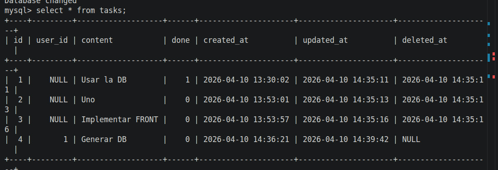

# Task & User Manager API

## Descripción General
API RESTful para gestionar tareas y usuarios con persistencia en base de datos MySQL. La aplicación implementa buenas prácticas de desarrollo incluyendo paginación, búsqueda, soft delete y relaciones entre entidades.

---

## ⚡ Inicio Rápido

### ⚠️ IMPORTANTE: Usar Conda Base

Este proyecto **SOLO se ejecuta con `conda base`**. No uses `.venv`.

```bash
# 1. PRIMERO: Activar conda base (OBLIGATORIO)
conda activate base

# Verificar que ves "base" en tu prompt:
# ✅ CORRECTO:   │ base Py │
# ❌ INCORRECTO: │ Contruccion_de_Software Py │
```

### Ejecutar el Proyecto

```bash
# Ir al directorio
cd /home/mq/Documentos/Construccion_Software/Contruccion_de_Software

# Asegurar que conda base está activo
conda activate base

# Opción 1: Configurar BD por primera vez
python database/db_setup.py

# Opción 2: Iniciar servidor
python back/app.py
```

**Acceder en:** `http://127.0.0.1:5000`

---

## Entorno: Conda Base

| Propiedad | Valor |
|-----------|-------|
| **Entorno** | `conda base` |
| **Python** | 3.13.12 |
| **Dependencias** | ✅ Incluidas en conda base |
| **Activación** | `conda activate base` |

---

## 🗄️ Replicación a PostgreSQL

El proyecto sincroniza datos entre MySQL (primaria) y PostgreSQL (réplica).

### Configuración Rápida

```bash
# 1. Iniciar PostgreSQL en Docker
docker run --name postgres-container \
  -e POSTGRES_USER=postgres \
  -e POSTGRES_PASSWORD=postgres \
  -e POSTGRES_DB=task_db_pg \
  -p 5432:5432 \
  -d postgres:15

# 2. Ejecutar replicador (crea tablas y sincroniza datos)
conda activate base && python database/db_replicator.py
```

**Salida esperada:**
```
✅ MySQL connected
✅ PostgreSQL connected
✅ Users synced (X rows)
✅ Tasks synced (X rows)
✅ Databases are in SYNC!
```

---

## Cambios Implementados

### 1. **Paginación en GET /tasks**

#### Justificación:
- **Rendimiento**: En aplicaciones con miles de tareas, traer todas a la vez causa:
  - Sobrecarga de la BD
  - Lentitud en la respuesta
  - Mayor consumo de memoria del cliente
  
- **UX mejorada**: El usuario ve resultados rápidos sin esperar a cargar millones de registros

#### Implementación:
```bash
GET /tasks?page=1&limit=20
```

**Parámetros:**
- `page` (int): Número de página (default: 1)
- `limit` (int): Cantidad de tareas por página (default: 20, máximo: 100)

**Respuesta:**
```json
{
  "tasks": [...],
  "pagination": {
    "page": 1,
    "limit": 20,
    "total": 150,
    "pages": 8,
    "has_next": true,
    "has_prev": false
  }
}
```

#### Beneficios:
✅ Reduce latencia de red  
✅ Reduce uso de memoria en BD  
✅ Permite navegación eficiente entre resultados  
✅ Escalable a millones de registros

---

### 2. **Búsqueda Textual en GET /tasks**

#### Justificación:
- **Usabilidad**: Los usuarios necesitan encontrar tareas específicas sin descargar todas
- **Eficiencia**: Búsqueda en BD es más rápida que en cliente
- **Combinable**: Funciona con paginación para resultados optimizados

#### Implementación:
```bash
GET /tasks?query=reportar&page=1&limit=20
```

**Características:**
- Case-insensitive (busca "REPORTAR", "reportar", "Reportar")
- Búsqueda de substring (contiene el texto)
- Funciona combinado con paginación

**Respuesta incluye:**
```json
{
  "tasks": [...],
  "search": {
    "query": "reportar"
  }
}
```

#### Casos de Uso:
- Filtrar tareas por nombre: `?query=email`
- Encontrar tareas urgentes: `?query=URGENTE`
- Combinar búsqueda y paginación: `?query=bug&page=2&limit=10`

#### Beneficios:
✅ Búsqueda eficiente en BD con índices  
✅ Reduce datos transferidos  
✅ Mejor experiencia de usuario  
✅ Escalabe a grandes volúmenes de datos

---

### 3. **Soft Delete (Eliminación Blanda)**

#### Justificación:
- **Auditoría**: Mantén registro de qué se eliminó y cuándo
- **Recuperación**: Permite restaurar datos accidentalmente eliminados
- **Integridad referencial**: No rompe relaciones con otros datos
- **Cumplimiento legal**: Algunos reglamentos exigen mantener historial

#### Problema del Hard Delete:
```sql
DELETE FROM tasks WHERE id = 5;  -- ❌ Información perdida para siempre
```

#### Solución - Soft Delete:
```sql
UPDATE tasks SET deleted_at = NOW() WHERE id = 5;  -- ✅ Información marcada como eliminada
```

#### Implementación en BD:
```sql
-- Columna agregada a tasks y users
ALTER TABLE tasks ADD COLUMN deleted_at DATETIME DEFAULT NULL;
```

#### Lógica de Negocio:
```python
# Obtener solo tareas activas (no eliminadas)
Task.query.filter(Task.deleted_at.is_(None))

# Obtener todo (incluyendo eliminadas)
Task.query.all()
```

#### Flujo de API:
```bash
DELETE /tasks/5  -- Marca como eliminada
GET /tasks       -- Solo muestra activas
GET /tasks/5     -- Retorna 404 (considerada eliminada)
```

#### Beneficios:
✅ Reversible: recuperable si es necesario  
✅ Auditoría completa de cambios  
✅ No rompe relaciones entre datos  
✅ Cumple normativas de retención de datos

---

### 4. **CRUD Completo para Usuarios con Relación a Tareas**

#### Justificación:
- **Asignación**: Cada tarea necesita un responsable
- **Relación 1:N**: Un usuario puede tener múltiples tareas
- **Persistencia**: Usuarios almacenados en BD (antes en memoria)
- **Gestión**: Crear, actualizar, eliminar usuarios de forma persistente

#### Modelo de Datos:

**Tabla: users**
```
id (PK)          - Identificador único
name (required)  - Nombre del usuario
lastname         - Apellido (opcional)
city             - Ciudad (opcional)
country          - País (opcional)
postal_code      - Código postal (opcional)
created_at       - Timestamp de creación
updated_at       - Timestamp de última actualización
deleted_at       - Timestamp de eliminación (NULL si activo)
```

**Tabla: tasks**
```
id (PK)          - Identificador único
user_id (FK)     - Referencia a usuario (relación)
content          - Descripción de la tarea
done             - Estado (true/false)
created_at       - Timestamp de creación
updated_at       - Timestamp de última actualización
deleted_at       - Timestamp de eliminación (NULL si activo)
```

#### Relación entre Tablas:
```
users (1) ──────────── (N) tasks
        
Un usuario tiene muchas tareas.
Cada tarea pertenece a un usuario.
Si se elimina un usuario, sus tareas se eliminan en cascada.
```

#### Endpoints CRUD de Usuarios:

**CREATE - POST /users**
```bash
curl -X POST http://localhost:5000/users \
  -H "Content-Type: application/json" \
  -d '{
    "name": "Juan",
    "lastname": "Pérez",
    "city": "Madrid",
    "country": "España",
    "postal_code": "28001"
  }'
```

**READ - GET /users**
```bash
# Listar todos (con paginación)
GET /users?page=1&limit=20

# Obtener usuario específico con sus tareas
GET /users/1
```

**UPDATE - PUT /users/:id**
```bash
curl -X PUT http://localhost:5000/users/1 \
  -H "Content-Type: application/json" \
  -d '{
    "name": "Juan Carlos",
    "city": "Barcelona"
  }'
```

**DELETE - DELETE /users/:id**
```bash
curl -X DELETE http://localhost:5000/users/1
# Soft delete: marca como eliminado sin perder datos
```

#### Endpoints CRUD de Tareas (Actualizado):

**CREATE - POST /tasks** (requiere user_id)
```bash
curl -X POST http://localhost:5000/tasks \
  -H "Content-Type: application/json" \
  -d '{
    "user_id": 1,
    "content": "Preparar reportes",
    "done": false
  }'
```

**READ - GET /tasks** (solo tareas de usuarios activos)
```bash
GET /tasks?page=1&limit=20&query=reportar
```

**UPDATE - PUT /tasks/:id** (puede cambiar usuario)
```bash
curl -X PUT http://localhost:5000/tasks/5 \
  -H "Content-Type: application/json" \
  -d '{
    "user_id": 2,
    "content": "Contenido actualizado",
    "done": true
  }'
```

**DELETE - DELETE /tasks/:id**
```bash
curl -X DELETE http://localhost:5000/tasks/5
```
---
#### Muestra de Tareas



---

#### Beneficios:
✅ Asignación clara de responsables  
✅ Trazabilidad: saber quién hace qué  
✅ Reportes: resumir tareas por usuario  
✅ Validación referencial: evita tareas huérfanas  
✅ Datos persistentes y recuperables


## Arquitectura de Base de Datos

```
task_db/
├── users
│   ├── id (PK)
│   ├── name (VARCHAR 80)
│   ├── lastname (VARCHAR 80)
│   ├── city (VARCHAR 100)
│   ├── country (VARCHAR 100)
│   ├── postal_code (VARCHAR 10)
│   ├── created_at (DATETIME)
│   ├── updated_at (DATETIME)
│   └── deleted_at (DATETIME, NULL)
│
└── tasks
    ├── id (PK)
    ├── user_id (FK → users.id) ON DELETE CASCADE
    ├── content (VARCHAR 200)
    ├── done (BOOLEAN)
    ├── created_at (DATETIME)
    ├── updated_at (DATETIME)
    └── deleted_at (DATETIME, NULL)
```

---

## Stack Tecnológico

| Componente | Tecnología |
|-----------|-----------|
| Backend | Flask + Flask-SQLAlchemy |
| BD | MySQL 9.6 |
| Driver | PyMySQL |
| Frontend | HTML5 + JavaScript Vanilla |
| Servidor | Flask Dev Server (producción: Gunicorn) |

---

## Flujo de Trabajo Recomendado

### 1. Crear Usuario
```bash
POST /users → Juan Pérez
```

### 2. Crear Tarea Asignada
```bash
POST /tasks → "Reportar progreso" (user_id: 1)
```

### 3. Buscar Tareas del Usuario
```bash
GET /tasks?query=reportar&page=1&limit=20
```

### 4. Actualizar Tarea (reasignar si es necesario)
```bash
PUT /tasks/1 → cambiar user_id a 2
```

### 5. Eliminar Tarea (reversible con soft delete)
```bash
DELETE /tasks/1 → marcada como eliminada, recuperable
```

---

## Mejoras Futuras

- [ ] Autenticación y autorización (JWT)
- [ ] Filtros avanzados (por estado, fecha, usuario)
- [ ] Estadísticas y reportes
- [ ] Historial de cambios completo
- [ ] Notificaciones en tiempo real
- [ ] Exportación a CSV/PDF

---

## Resumen de Beneficios

| Característica | Beneficio |
|---|---|
| Paginación | ⚡ Rendimiento mejorado, escalabilidad |
| Búsqueda | 🔍 Usabilidad, eficiencia |
| Soft Delete | 🛡️ Auditoría, recuperación, cumplimiento |
| CRUD Usuarios | 👥 Asignación, trazabilidad, validación |
| Relaciones BD | 🔗 Integridad referencial, consultas complejas |

---

## ❌ Troubleshooting

### Error: "ModuleNotFoundError: No module named 'flask'"

**Causa:** No estás usando conda base.

**Solución:**
```bash
# ❌ MALO - Estás en .venv
source .venv/bin/activate  # NO HAGAS ESTO

# ✅ CORRECTO - Usa conda
conda deactivate
conda activate base
python back/app.py
```

### Error: Prompt muestra "Contruccion_de_Software Py" en lugar de "base Py"

**Causa:** Tienes `.venv` activado.

**Solución:**
```bash
# Desactivar .venv
deactivate

# Activar conda base
conda activate base

# Verificar (debe mostrar "base Py"):
echo $CONDA_DEFAULT_ENV
```

### Error: "Port 5000 is already in use"

```bash
# Encontrar y matar proceso
lsof -i :5000 | grep -v COMMAND | awk '{print $2}' | xargs kill -9

# O usar otro puerto
python -c "import os; os.environ['FLASK_ENV']='development'; from back.app import create_app; app = create_app(); app.run(debug=True, port=5001)"
```

### Error: Database connection refused

```bash
# Verificar que MySQL funciona
docker ps -a | grep mysql

# Si no está corriendo:
docker start mysql-container

# O recrear:
docker run --name mysql-container \
  -e MYSQL_ROOT_PASSWORD=my-secret-pw \
  -p 3306:3306 \
  -d mysql:9.6
```

### ✅ Verificar Entorno Correcto

```bash
# Debe mostrar "base"
echo $CONDA_DEFAULT_ENV

# Debe mostrar Python desde conda
which python

# Debe mostrar versión 3.13+
python --version

# Deben estar instalados
python -c "import flask; import sqlalchemy; print('✅ Dependencias OK')"
```

---